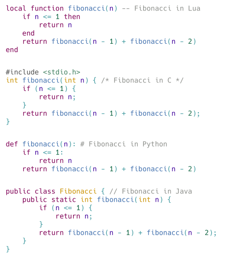

# highlighter.sile

[](LICENSE)
[](https://github.com/Omikhleia/highlighter.sile/actions?workflow=Luacheck)
[](https://luarocks.org/modules/Omikhleia/highlighter.sile)

This package for the [SILE](https://github.com/sile-typesetter/sile) typesetting system provides a code “syntax highlighter”.

It's a simple wrapper around the Scintillua syntax highlighting library, providing a SILE package to use it.



The package works both with SILE's standard distribution and with the [**resilient.sile**](https://github.com/Omikhleia/resilient.sile) collection of classes and packages.
In the latter case, it subscribes to the resilient styling paradigm, allowing for fine-grained control over the appearance of the highlighted code.

## Installation

This package require SILE v0.15 or upper.

Installation relies on the **luarocks** package manager.

To install the latest version, you may use the provided “rockspec”:

```
luarocks install highlighter.sile
```

(Refer to the SILE manual for more detailed 3rd-party package installation information.)

## Usage

Examples are provided in the [examples](./examples) folder.

The in-code package documentation may also be useful.

TODO: A readable version of the documentation is included in the User Manual for the [resilient.sile](https://github.com/Omikhleia/resilient.sile) collection of classes and packages.

## License

All SILE-related code and samples in this repository are released under the MIT License, (c) 2025,Omikhleia.

The syntax highlighting support (as a Git submodule) is Scintillua, which is released under the MIT License, (c) 2006-2015, Mitchell.
